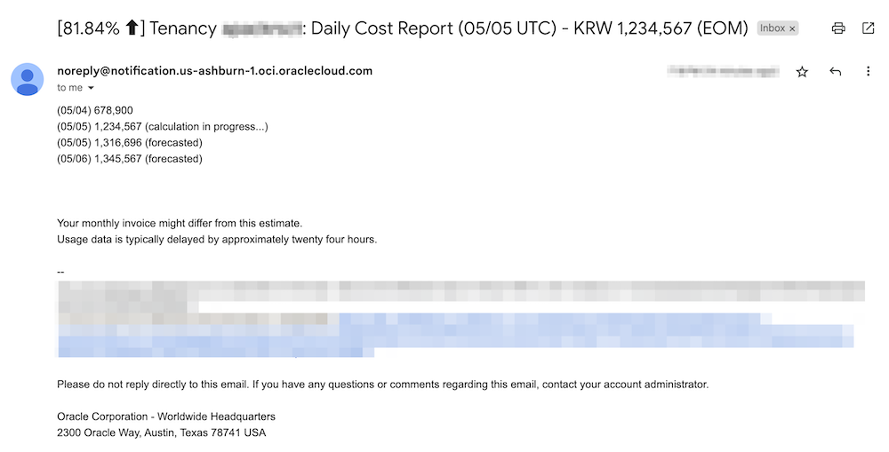
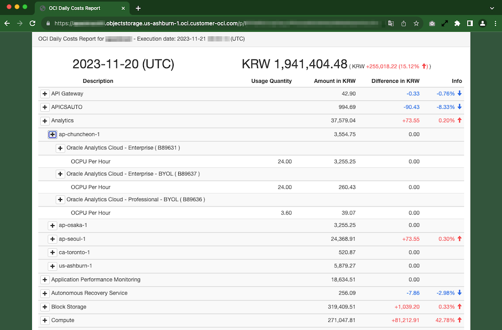
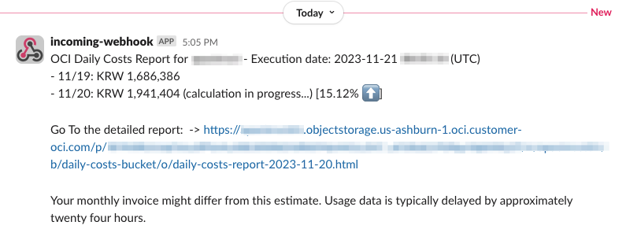

# Report Daily Cost using Usage API and Notification

*Do this steps in your home region.*


## Create a Notification Topic and Subscribe

1. Open the navigation menu and click **Developer Services**. Under **Application Integration**, click **Notifications**.

2. Click **Create Topic**. Enter the following:

    - Name: ex, `daily-cost-notification-topic`
    - Description(Optional): A friendly description. You can change this value later if you want to.

    Click **Create**

3. Click the created topic

4. Click **Create Subscription**. Enter the following:

    - Protocol: Email
    - Email: Your email address

    Click **Create**

5. Go to your email client. And click the received Subscription Confirmation email. And click the **Confirmation subscription** link.

6. Go back to OCI Console. Check if the state of your topic subscription is Active.

7. Copy the Topic OCID.


## Create a Object Storage Bucket

1. Open the navigation menu and click **Storage**. Under **Object Storage & Archive Storage**, click **Bucket**.

2. Click **Create Bucket**. Enter the following:

    - Bucket Name: ex, `daily-costs-bucket`


## Create a compute instance

1. Open the navigation menu and click **Compute**. Under **Compute**, click **Instances**.

2. Create a compute instance

3. Copy the instance's OCID.


## Create a Policy for this compute to run the script.

1. Login to your OCI Cloud console

2. Create new Policy: `scheduled-report-daily-costs-policy` with Statements:

    - Update `request.instance.id` with your compute instance id
    - Update `target.bucket.name` with your Bucket name
    - Update `<compartment-name>` with your compartment name that the compute instance is located in


        ```
        allow any-user to read usage-reports in tenancy where request.instance.id='ocid1.instance.oc1.iad.aaaaaaaa.....'
        allow any-user to use ons-family in compartment <compartment-name> where request.instance.id='ocid1.instance.oc1.iad.aaaaaaaa.....'
        allow any-user to manage objects in compartment <compartment-name> where all {request.instance.id='ocid1.instance.oc1.iad.aaaaaaaa.....', target.bucket.name='daily-costs-bucket', any {request.permission='OBJECT_CREATE', request.permission='OBJECT_DELETE', request.permission='OBJECT_READ', request.permission='PAR_MANAGE'}}
        ```

## Setup Report Daily Costs scripts

1. SSH into the instance

2. Install the Python OCI SDK

    ```
    pip3 install oci
    ```

3. Copy the report_daily_costs source into /home/opc

    ```
    sudo dnf install git
    git clone https://github.com/TheKoguryo/report_daily_costs.git
    ```

4. Update the value of ONS_TOPIC_ID to your Topic OCID and the value of BUCKET_NAME to your Bucket in run_report_daily_costs.sh

    ```
    export ONS_TOPIC_ID=ocid1.onstopic.oc1.iad.aaaaaaaa.....
    export BUCKET_NAME=daily-costs-bucket
    ```

5. Update the value of alert-threshold, alert_threshold_n in run_report_daily_costs.sh

    ```
    # cron schedule - 0 * * * * 
    # Notify at 23:00 UCT
    #
    # Check the yesterday's cost every hours that is under being calculated.
    * (Your monthly invoice might differ from this estimate. Usage data is typically delayed by approximately twenty four hours.)
    # at 23:00 UCT: Notify the yesterday's cost
    # at 00:00 UCT ~ 22:00 UCT: If the yesterday's cost is more than the cost of the day before yesterday and the difference is over threshold, notify at that time.
    # at 00:00 UCT ~ 22:00 UCT: At the same day, another notification will be occurred when the new difference is over the first notified difference + second threshold(alert_threshold_n)

    python3 $APPDIR/report_daily_costs_v2.py -ip --ons_topic_id $ONS_TOPIC_ID --bucket_name $BUCKET_NAME --alert_threshold 30 --alert_threshold_n 20

    ```

6. Create a cron job. In the terminal, type:

    ```
    crontab -e
    ```

7. Type ``i`` to insert a new line.

8. Write your running schedule.

    I recommend a cron schedule to every hour.

    ```
    ###############################################################################
    # Crontab to run report_daily_costs
    ###############################################################################
    0 * * * * timeout 1h /home/opc/report_daily_costs/run_report_daily_costs.sh >> /home/opc/report_daily_costs/run_report_daily_costs.sh_run.txt 2>&1
    ```

    *Syntax of crontab:*
    
        * * * * * command to be executed
        - - - - -
        | | | | |
        | | | | ---- Day of week (0 - 7) (Sunday=0 or 7)
        | | | ------ Month (1 - 12)
        | | -------- Day of month (1 - 31)
        | ---------- Hour (0 - 23)
        ------------ Minute (0 - 59)

    > You can also use a helper site such as https://crontab.guru to help you set the optimal execution times.

9. Save and close the file (ESC, then :x or :wq).

10. When the cost is more than thread or At 23:00 Every day. 

    - Email

        

    - Detailed Report
    
        


## Notification Topic - Another Subscription

1. Click the created topic

2. Click **Create Subscription**. Enter the following:

    - Protocol: Slack

3. Configure the required setting as the following.

    - [How to send notification on Slack using Webhooks](https://learnoci.cloud/how-to-send-notification-on-slack-using-webhooks-5e36f1d46295)

4. You can see the notification message in your slack

    - Slack

        


## Related Documents

- [Use the Crontab Utility to Schedule Tasks on Oracle Linux](https://docs.oracle.com/en/learn/oracle-linux-crontab/index.html#before-you-begin)
